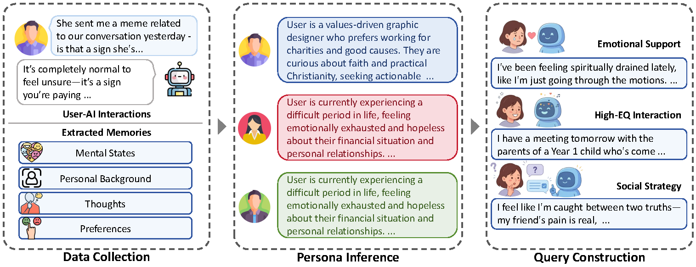
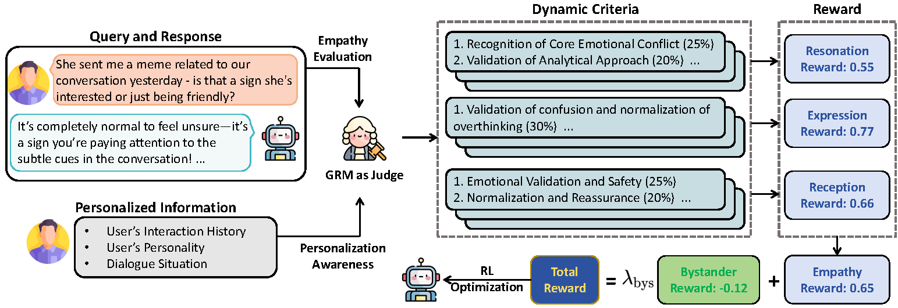

# From Empathy to Personalized Empathy: Adapting Empathetic Strategies to Individual Users

------

## Overview

We focus on the ***personalized empathy*** task: Given empathy-seeking queries, the goal is to tailor empathetic strategies to the user's distinctive characteristics (e.g., personality, emotional experiences, and psychological state) as derived from their long-term history, ensuring contextually appropriate over generic support.

In our setting, the LLM will leverage the user's extracted memories and query to generate a empathetic and personalized suitable response.

This repository contains three main components:

- `prepare_dataset/`: dataset filtering, personalized query generation, query inspection, and final data formatting.
- `train/`: verl-based GRPO training with PERM reward functions.
- `evaluation/`: fixed-criteria generation and PERM evaluation scripts.

------

## Quick Start

### Installation

You can set up the environment as follows:

```bash
conda create -n perm python=3.12
conda activate perm
pip install -r requirements.txt
```

Some CUDA-related packages, such as `flash-attn`, `vllm`, and `torch`, may require a GPU environment that matches your CUDA and driver versions.

------

### Dataset Preparation



To build the personalized empathy dataset:

```bash
cd prepare_dataset
python filter.py

export DATA_API_KEYS="your_api_key"
export DATA_BASE_URLS="https://api.deepseek.com"
export DATA_MODEL_NAME="deepseek-chat"
export DATA_RUN_MODE="full_pipeline"

python query.py
```

The dataset pipeline includes intent/memory filtering, persona extraction, EQ situation generation, personalized query generation, query inspection, and language-based export.

See [prepare_dataset/README.md](prepare_dataset/README.md) for details.

------

### PereGRM Training

PereGRM is a reward modeling framework that combines the empathy evaluation structure with dynamic evaluation criteria generation for fine-grained reward modeling.



First convert the final JSON dataset into verl-compatible parquet format:

```bash
cd train
python prepare_dataset.py \
  --input_file ../prepare_dataset/dataset/ei_trainset/final_data/English.json \
  --output_path ./data/train.parquet \
  --split train
```

Then configure training paths and judge model endpoints through environment variables:

```bash
export TRAIN_FILES="/path/to/train.parquet"
export VAL_FILES="/path/to/val.parquet"
export MODEL_PATH="/path/to/base/model/or/hf-repo"

export JUDGE_API_KEY="your_api_key"
export JUDGE_BASE_URL="your_base_url"
export JUDGE_MODEL="your_judge_model"

export EVAL_JUDGE_API_KEY="your_api_key"
export EVAL_JUDGE_BASE_URL="your_base_url"
export EVAL_JUDGE_MODEL="your_eval_judge_model"
```

Launch training with:

```bash
bash train_llm.sh
```

The training pipeline is built on **GRPO-style reinforcement learning**, integrating multi-perspective empathy rewards to guide policy optimization.

See [train/README.md](train/README.md) for details.

------

## Evaluation

For evaluation with fixed criteria, first generate query-specific criteria and then score model predictions:

```bash
cd evaluation
python prepare_criteria.py \
  --input ../prepare_dataset/dataset/ei_trainset/final_data/English.json \
  --output ./criteria/English_criteria.json

export EVAL_DATASET_PATH="../prepare_dataset/dataset/ei_trainset/final_data/English.json"
export EVAL_PREDICT_PATH="./predictions/model_outputs.json"
export EVAL_CRITERIA_PATH="./criteria/English_criteria.json"
export EVAL_API_KEY="your_api_key"
export EVAL_BASE_URL="https://api.deepseek.com"
export EVAL_MODEL="deepseek-chat"

bash eval.sh
```

See [evaluation/README.md](evaluation/README.md) for details.

We also report the results on [EQ-Bench3](https://github.com/EQ-bench/eqbench3) and [EmoBench](https://github.com/Sahandfer/EmoBench).
